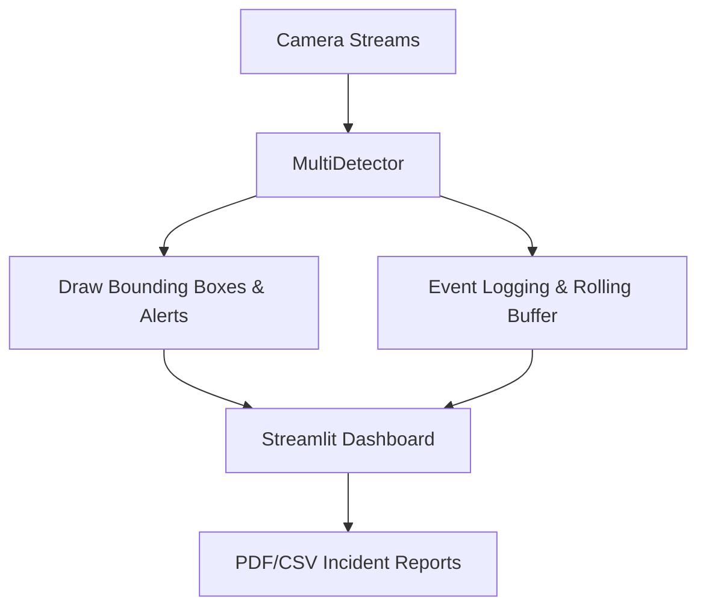

# HaloSight – Intelligent Multi-Camera Safety Monitoring System


## **Table of Contents**

1. [Project Overview](#project-overview)
2. [Problem Statement](#problem-statement)
3. [Proposed Solution](#proposed-solution)
4. [Key Features](#key-features)
5. [Architecture & Tech Stack](#architecture--tech-stack)
6. [Installation & Setup](#installation--setup)
7. [Usage](#usage)
8. [File Structure](#file-structure)
9. [Future Scope](#future-scope)
10. [Credits](#credits)

---

## **Project Overview**

HaloSight is a real-time, AI-powered safety monitoring system designed for hazardous or high-risk environments. It detects objects, personal protective equipment (PPE), and hazards using computer vision and issues multi-level alerts to operators via a live dashboard.

The system supports multiple cameras, rolling video buffers, event logging, and PDF incident report generation. It is optimized for edge devices with GPU acceleration using TensorRT where available.

---

## **Problem Statement**

Workplace and industrial environments often expose personnel to hazards like tools, chemicals, or fire. Manual monitoring is error-prone and can delay incident response. HaloSight automates hazard detection, provides live alerts, and records evidence for safety compliance.

---

## **Proposed Solution**

HaloSight uses a combination of:

* **Real-time object detection** with YOLOv8
* **Multi-camera support** for full-area coverage
* **Safety zone monitoring** to track personnel relative to dangerous areas
* **Alert prioritization**: Info → Caution → Warning → Critical
* **Rolling video buffers** for automatic clip saving of critical events
* **Operator dashboard** built with Streamlit for live monitoring, event logs, and PDF reports

---

## **Key Features**

* Real-time detection of hazards, tools, and personnel
* Interactive safety zone definition
* Multi-camera live feed display
* Multi-level alerting with audio cues
* Rolling video buffer (5–10 seconds) for automatic critical clip saving
* Event logging and export to CSV & PDF reports
* Optional PPE detection and fire/smoke detection
* GPU acceleration with TensorRT support on NVIDIA devices
* FPS/latency measurement for performance monitoring

---

## **Architecture & Tech Stack**

**Tech Stack**:

* **Python 3.11+**
* **Ultralytics YOLOv8** for object detection
* **OpenCV** for video processing
* **Streamlit** for live dashboard interface
* **FPDF** for incident report generation
* **NumPy / Pandas** for data handling
* **Threading** for non-blocking multi-camera processing

**Architecture Overview**:

```
+-------------------+       +---------------------+       +--------------------+
|   Camera Streams  | ----> | MultiDetector (YOLO)| ----> | Alert System       |
+-------------------+       +---------------------+       +--------------------+
        │                          │                           │
        │                          ├─> Audio Alerts (beeps)   │
        │                          └─> Event Logging & Buffer │
        │                                                     
        └----------------------> Dashboard (Streamlit) <------┘
                                  │
                                  ├─> Live Multi-Camera Feed
                                  ├─> Safety Zone Overlays
                                  └─> PDF & CSV Reports
```

**Workflow Diagram**:



---

## **Installation & Setup**

1. **Clone the repository**

```bash
git clone https://github.com/yourusername/HaloSight.git
cd HaloSight
```

2. **Create virtual environment**

```bash
python -m venv myenv
myenv\Scripts\activate      # Windows
# OR
source myenv/bin/activate   # Linux/Mac
```

3. **Install dependencies**

```bash
pip install -r requirements.txt
```

4. **Download YOLOv8 pretrained model**

```bash
# For general object detection
wget https://github.com/ultralytics/assets/releases/download/v8.3.0/yolov8n.pt -P models/
```

5. **(Optional) Download PPE / Fire detection models**

* Save to `models/ppe_yolov8.pt` and `models/fire_yolov8.pt`

---

## **Usage**

1. **Run a smoke test**

```bash
python src/step1_smoke_test.py
```

2. **Run the main dashboard**

```bash
streamlit run src/dashboard.py
```

3. **Interacting with the dashboard**

* Define safety zones using the canvas
* Monitor multiple camera feeds
* Observe real-time alerts and bounding boxes
* Download incident PDF reports from the “Export Incident Report” button

---

## **File Structure**

```
HaloSight/
│
├─ src/
│   ├─ main.py              # MVP detection loop (camera + safety zone)
│   ├─ dashboard.py         # Streamlit multi-camera operator dashboard
│   ├─ detectors.py         # Multi-model detector class
│   ├─ alerts.py            # Alerting system (audio + bounding boxes)
│   ├─ zone_overlay.py      # Safety zone overlays
│   ├─ recorder.py          # Rolling buffer video clip saving
│   └─ step1_smoke_test.py  # YOLO setup and FPS check
│
├─ models/                  # YOLO weights
│   └─ yolov8n.pt
├─ logs/                    # CSV logs & incident PDFs
├─ docs/                    # Diagrams, logos, screenshots
├─ requirements.txt
└─ README.md
```

---

## **Future Scope**

* Multi-camera 360° coverage with synchronized frames
* Depth perception & 3D safety zones
* Foundation model integration (SAM, CLIP) for smarter segmentation
* IoT alert triggers (lights, buzzers)
* Cloud connectivity for remote monitoring & alert notifications

---

## **Credits**

* YOLOv8 – Ultralytics
* Streamlit – Dashboard UI
* OpenCV – Computer vision processing
* FPDF – PDF report generation

---

## **License**

MIT License © 2025 SkyLine Team
